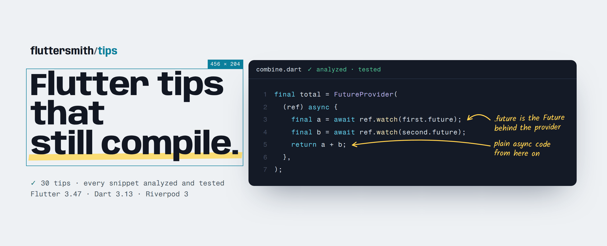
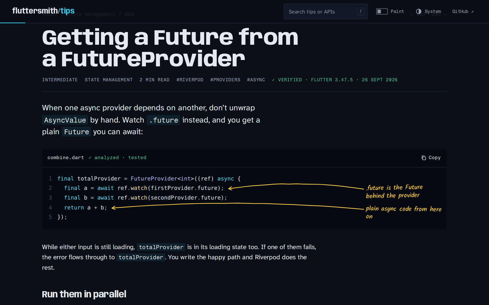
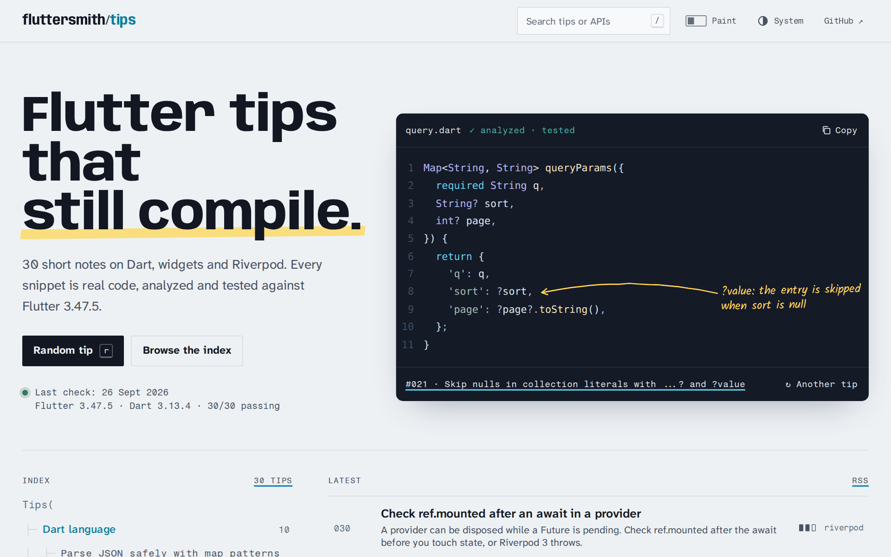
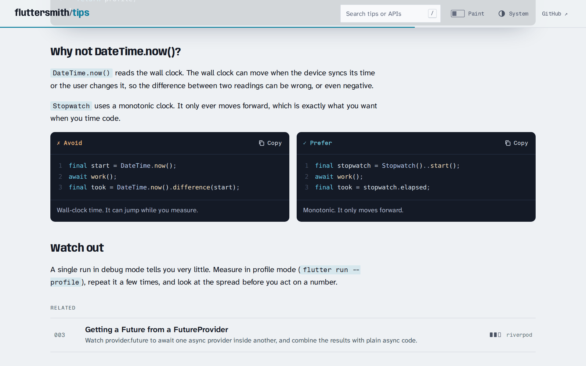
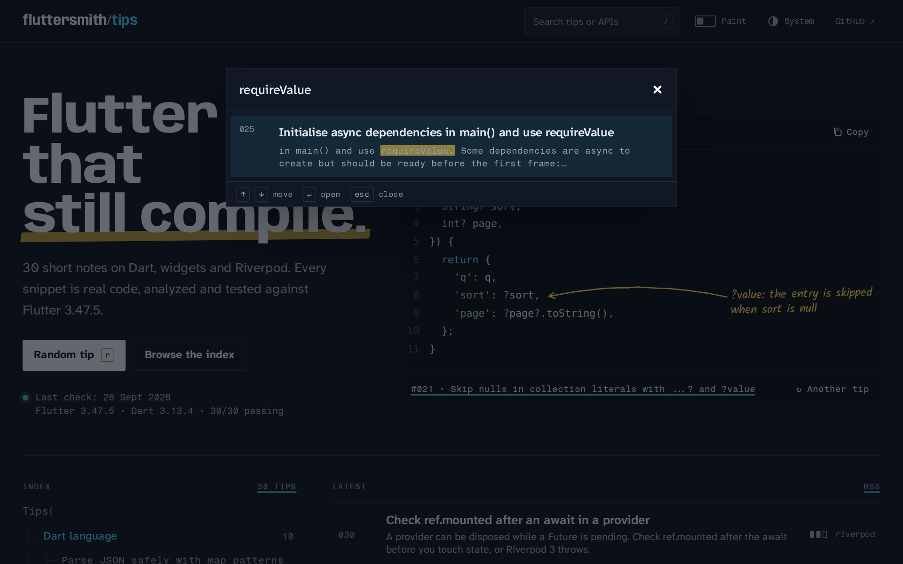
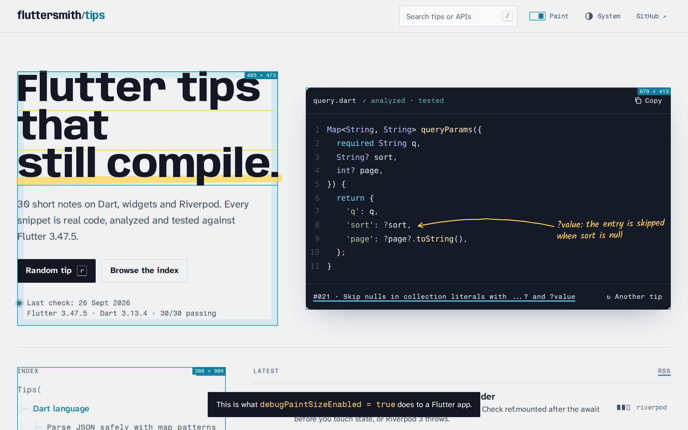
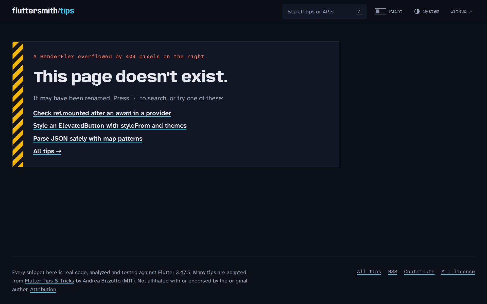
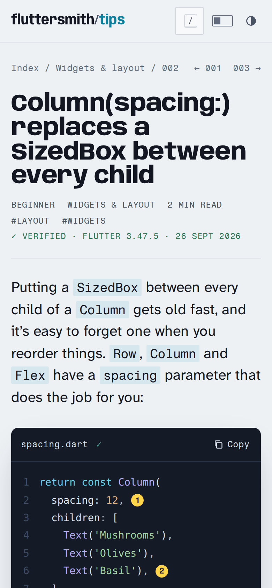
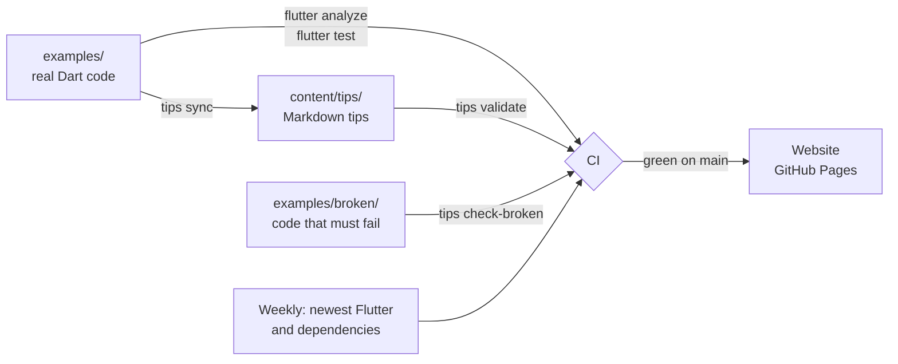

<a href="https://fluttersmith.github.io/tips/">
  <picture>
    <source media="(prefers-color-scheme: dark)" srcset=".github/assets/banner-dark.png">
    
  </picture>
</a>

<p align="center">
  <a href="https://fluttersmith.github.io/tips/"><b>Read on the web</b></a> ·
  <a href="CATALOG.md">All tips</a> ·
  <a href="#learning-paths">Learning paths</a> ·
  <a href="CONTRIBUTING.md">Write a tip</a>
</p>

<p align="center">
  <a href="https://github.com/FlutterSmith/tips/actions/workflows/ci.yml"></a>
  
  
  
  
  <a href="LICENSE"></a>
</p>

Short, practical notes on Dart, Flutter widgets and Riverpod, for developers who already ship Flutter apps and want the small things that make code cleaner, faster and safer.

The difference from every other tips list: **you can't break one of these without CI noticing.** Every snippet is copied from real code that is analyzed with strict lints and covered by a test. Once a week the whole collection is rebuilt against the newest Flutter release, and anything that stops compiling gets flagged.

## A tip in twenty seconds

This is what a snippet looks like in the source. The `// @note` lines are the author talking to you:

```dart
final totalProvider = FutureProvider<int>((ref) async {
  // @note .future is the Future behind the provider
  final a = await ref.watch(firstProvider.future);
  final b = await ref.watch(secondProvider.future);
  // @note plain async code from here on
  return a + b;
});
```

On the website those notes turn into handwritten margin notes, with an arrow drawn to the exact line:



The code isn't pasted into the tip. `tips sync` copies it from [`examples/`](examples/lib/tips/future-provider-future/combine.dart), where a [test](examples/test/tips/future_provider_future_test.dart) checks that the provider really waits for both inputs, really surfaces loading, and really picks up overrides.

## What you get

| | |
|:--|:--|
| **Code you can copy** | Every snippet is text, never a screenshot. One click copies it without the notes. |
| **Proof, not promises** | 128 tests back the 30 tips. "Don't do this" examples live in [`examples/broken/`](examples/broken) and CI checks they fail with exactly the error the tip describes. |
| **Current APIs** | Written for Flutter 3.47, Dart 3.13 and Riverpod 3. Every tip shows the version it was last verified against. |
| **Search that knows code** | Type `requireValue` or `ref.listen` and land on the right tip. Search reads the snippets, not just the titles. |
| **Built to learn from** | Categories, tags, three ordered learning paths, and a level on every tip. |
| **Readable anywhere** | Light and dark themes, works on a phone, full keyboard navigation, and alt text required on every image. |

## A quick tour

<table>
  <tr>
    <td width="50%"></td>
    <td width="50%"></td>
  </tr>
  <tr>
    <td><b>Home.</b> The index is laid out as a widget tree. The snippet on the right rotates through real tips.</td>
    <td><b>Avoid / Prefer.</b> Side-by-side comparisons, marked with a shape and a label as well as a colour.</td>
  </tr>
  <tr>
    <td></td>
    <td></td>
  </tr>
  <tr>
    <td><b>Search.</b> Press <kbd>/</kbd> anywhere. It finds API names inside code.</td>
    <td><b>Paint.</b> Press <kbd>p</kbd> to see the page the way <code>debugPaintSizeEnabled</code> shows a Flutter app.</td>
  </tr>
  <tr>
    <td></td>
    <td align="center"></td>
  </tr>
  <tr>
    <td><b>Not found.</b> You'll recognise the stripes.</td>
    <td><b>On a phone.</b> Notes become numbered markers, listed under the code.</td>
  </tr>
</table>

## The tips

<!-- tips:catalog -->

**30 tips** in 3 categories. Tap a category to open it.

<details>
<summary><b>Dart language</b> · 10 tips</summary>

- `001` [Measure execution time with Stopwatch](content/tips/stopwatch-measure-time/index.md): DateTime.now() reads the wall clock, which can jump. Stopwatch can't, so use it to time code.
- `005` [A Result type with a sealed class](content/tips/sealed-class-result/index.md): Return success or failure instead of throwing, and let an exhaustive switch make sure every caller handles both.
- `008` [Switch on a record to match several values at once](content/tips/switch-on-records/index.md): Put two or three values in a record and switch on it. Each case is a row in a table, instead of a tangle of if/else.
- `010` [Return multiple values with a record](content/tips/records-multiple-returns/index.md): A record returns two or more values without a throwaway class, and destructuring unpacks them in one line at the call site.
- `013` [Destructure lists with list patterns](content/tips/destructure-lists/index.md): List patterns pull values out of a list by position, and a rest element skips or collects whatever sits in the middle.
- `016` [Await several futures with a record's .wait](content/tips/future-wait-records/index.md): Future.wait gives you a List of Object. A record of futures with .wait keeps each type and tells you which one failed.
- `019` [Extension types vs extension methods](content/tips/extension-types/index.md): An extension method adds to a type. An extension type wraps it in a new static type, so a UserId can't be passed where an OrderId belongs.
- `021` [Skip nulls in collection literals with ...? and ?value](content/tips/null-aware-elements/index.md): The null-aware spread adds nothing for a null list, and a null-aware element leaves out a null entry, so you can drop the if (x != null).
- `024` [firstOrNull instead of try/catch on StateError](content/tips/first-or-null/index.md): first, firstWhere and single throw when nothing matches. The OrNull versions return null, and the type system makes you handle it.
- `028` [Parse JSON safely with map patterns](content/tips/json-pattern-matching/index.md): A switch on a map pattern checks keys and value types in one go, so bad JSON reaches your fallback case instead of a TypeError.

</details>
<details>
<summary><b>Widgets & layout</b> · 10 tips</summary>

- `002` [Column(spacing:) replaces a SizedBox between every child](content/tips/column-row-spacing/index.md): Row, Column and Flex take a spacing value, so you no longer need a SizedBox or the gap package between children.
- `004` [Check context.mounted after every await](content/tips/context-mounted-async-gaps/index.md): A BuildContext can go stale while you await. Check context.mounted before you use it again, or grab what you need first.
- `007` [Use MediaQuery.sizeOf instead of MediaQuery.of](content/tips/mediaquery-sizeof/index.md): MediaQuery.of rebuilds your widget when anything changes. MediaQuery.sizeOf and friends rebuild only when the value you read changes.
- `011` [Return SizedBox.shrink() when there is nothing to show](content/tips/sizedbox-shrink/index.md): A build method must return a widget. For "nothing", return const SizedBox.shrink(), not an empty Container.
- `015` [Give buttons the same width with IntrinsicWidth](content/tips/intrinsic-width/index.md): Wrap a Column in IntrinsicWidth and stretch its children, and every button matches the widest one, whatever the text size.
- `017` [Replace Container with the widgets it wraps](content/tips/replace-container/index.md): Container is a bundle of Padding, ColoredBox, DecoratedBox, Align and SizedBox. Use those directly and the whole subtree can be const.
- `020` [React to the app going to the background with AppLifecycleListener](content/tips/app-lifecycle-listener/index.md): AppLifecycleListener gives you one named callback per lifecycle transition. No observer mixin needed, but you must dispose it.
- `023` [Make text selectable across widgets with SelectionArea](content/tips/selection-area/index.md): Wrap a subtree in SelectionArea and one selection runs across all its Text widgets. SelectionContainer.disabled carves out the parts to skip.
- `026` [Show real progress with a value on progress indicators](content/tips/determinate-progress/index.md): Give CircularProgressIndicator or LinearProgressIndicator a value from 0.0 to 1.0 and they show how far along you are instead of spinning.
- `029` [Style an ElevatedButton with styleFrom and themes](content/tips/elevated-button-style/index.md): Use ElevatedButton.styleFrom for one button, ElevatedButtonThemeData for all of them, and WidgetStateProperty when a style depends on state.

</details>
<details>
<summary><b>State management</b> · 10 tips</summary>

- `003` [Getting a Future from a FutureProvider](content/tips/future-provider-future/index.md): Watch provider.future to await one async provider inside another, and combine the results with plain async code.
- `006` [The parts of a Riverpod 3 provider](content/tips/provider-anatomy/index.md): A provider is a global variable, a type, a body that gets a Ref, and optional modifiers. Here is what each part does.
- `009` [ref.watch, ref.read or ref.listen?](content/tips/ref-watch-read-listen/index.md): Watch to rebuild, read for a one-off value inside a callback, listen to run side effects like SnackBars.
- `012` [Which Riverpod 3 provider should you use?](content/tips/which-provider/index.md): Six providers cover almost every job in Riverpod 3. StateProvider, StateNotifierProvider and ChangeNotifierProvider now live in legacy.dart.
- `014` [One widget for AsyncValue loading and error states](content/tips/async-value-widget/index.md): Wrap AsyncValue in a small widget with a switch over AsyncData, AsyncError and AsyncLoading, and every async screen writes only its data UI.
- `018` [AsyncValue.guard instead of try/catch in notifiers](content/tips/async-value-guard/index.md): AsyncValue.guard runs a Future and hands back AsyncData or AsyncError, so notifier methods need no try/catch.
- `022` [Pass arguments to a Notifier through its constructor](content/tips/notifier-with-arguments/index.md): In Riverpod 3 a family notifier is a plain Notifier that takes its argument in the constructor, so every method can use it as a field.
- `025` [Initialise async dependencies in main() and use requireValue](content/tips/require-value-async-init/index.md): Await a FutureProvider once before runApp, then read it synchronously everywhere with requireValue. No loading states for things that are always ready.
- `027` [Migrate a StateNotifier to a Notifier](content/tips/notifier-replaces-state-notifier/index.md): StateNotifier now lives in legacy.dart. Moving to Notifier takes a few mechanical steps, and one behaviour change is worth knowing about.
- `030` [Check ref.mounted after an await in a provider](content/tips/ref-mounted/index.md): A provider can be disposed while a Future is pending. Check ref.mounted after the await before you touch state, or Riverpod 3 throws.

</details>
<!-- /tips:catalog -->

The full numbered list is in [CATALOG.md](CATALOG.md).

## Learning paths

Some tips are better read in order:

- **[Modern Dart](https://fluttersmith.github.io/tips/paths/modern-dart/)**: records, patterns, sealed classes and extension types, in eight steps.
- **[Riverpod 3 from zero](https://fluttersmith.github.io/tips/paths/riverpod-3/)**: from what a provider is to async state, arguments and safe updates, in ten.
- **[Cleaner widget code](https://fluttersmith.github.io/tips/paths/cleaner-widgets/)**: seven habits that make build methods shorter and rebuilds cheaper.

## Keyboard shortcuts

| Key | Does |
|:--|:--|
| <kbd>/</kbd> | Search |
| <kbd>r</kbd> | Random tip |
| <kbd>←</kbd> <kbd>→</kbd> | Previous / next tip |
| <kbd>c</kbd> | Copy the first snippet |
| <kbd>p</kbd> | Debug paint on or off |
| <kbd>t</kbd> | Theme: system, light, dark |

## How it stays correct



```
content/tips/<slug>/index.md        the tip: frontmatter, prose, excerpt markers
examples/lib/tips/<slug>/*.dart     the code, with #docregion and // @note markers
examples/test/tips/*_test.dart      tests that prove each tip's claim
examples/broken/<slug>/*.dart       counter-examples, each with the error it must produce
tool/                               the tips CLI: new, sync, validate, generate, check-broken
site/                               the website (Astro, Pagefind)
```

## Run it locally

You need Flutter (the version is pinned in [`.fvmrc`](.fvmrc)) and, for the website, Node 22.

```sh
(cd tool && dart pub get) && (cd examples && flutter pub get)
dart run tool/bin/tips.dart validate          # content rules
(cd examples && flutter analyze lib test && flutter test)

dart run tool/bin/tips.dart generate --site   # data for the website
cd site && npm ci && npm run build && npm run preview
```

Or open the repo in a Codespace. The dev container has everything installed.

## Contributing

Spotted a typo or an outdated API? Edit the Markdown and open a pull request; you don't need Flutter for that. Want to add a tip? `dart run tool/bin/tips.dart new "Your title" -c dart` scaffolds the tip, its example and its test. [CONTRIBUTING.md](CONTRIBUTING.md) covers the format and the voice.

Curious why it's built this way? The original analysis, the plan and the design notes are in [`docs/`](docs/).

## Credits

This project grew out of Andrea Bizzotto's [Flutter Tips & Tricks](https://github.com/bizz84/flutter-tips-and-tricks), a well-loved collection first shared on social media between 2021 and 2024. Many tips here are adapted from it or inspired by it, and each one links back to its original. The code was rewritten for current Flutter, Dart and Riverpod, and it is now compiled and tested. See [ATTRIBUTION.md](ATTRIBUTION.md) for the full list. This project is not affiliated with or endorsed by the original author.

## License

[MIT](LICENSE). Portions adapted from Flutter Tips & Tricks, Copyright (c) 2022 Andrea Bizzotto, also under the MIT License.
